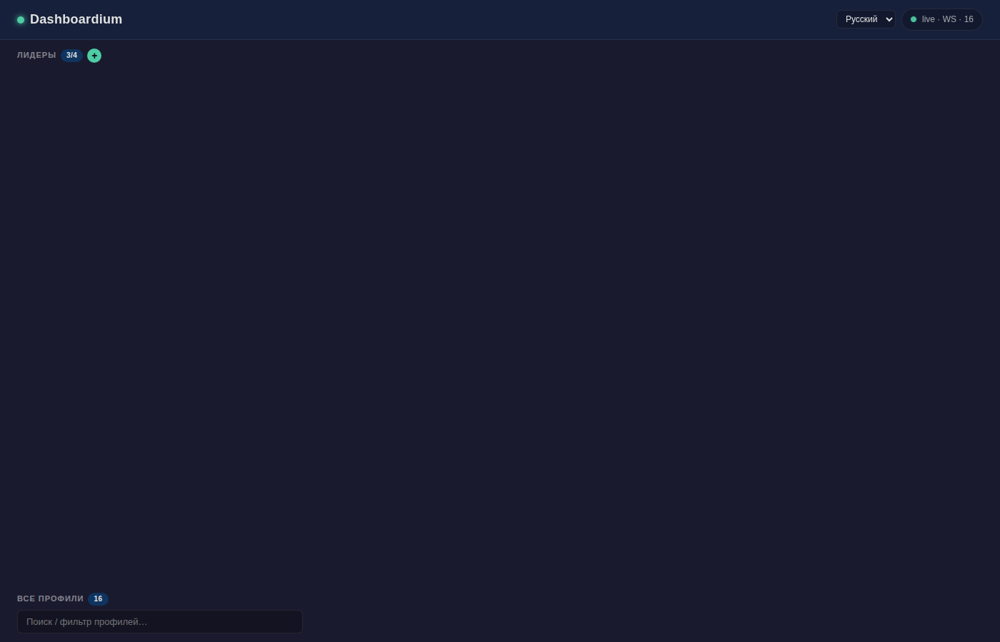

# Dashboardium

[](https://opensource.org/licenses/MIT)
[](https://nodejs.org)
[](https://hermes-agent.nousresearch.com)

**Панель управления профилями Hermes Agent** — мониторинг, чат и Kanban-задачи в реальном времени.



---

## Что это и зачем

Если у вас запущено несколько профилей [Hermes Agent](https://hermes-agent.nousresearch.com) (orchestrator, backend, frontend, devops, qa и т.д.), Dashboardium даёт единую панель для:

- **Мониторинга** — какие профили активны, сколько потребляют контекста, какие задачи висят
- **Чата** — отправка сообщений любому профилю прямо из браузера, ответ приходит в реальном времени
- **Kanban** — просмотр и управление задачами (блокировка, переназначение, архивация)
- **Watched-профилей** — избранные профили всегда сверху, остальные скрыты

Всё обновляется по WebSocket без перезагрузки страницы.

---

## Быстрый старт

```bash
git clone https://github.com/zcat7449/dashboardium.git
cd dashboardium

# Бэкенд
cd backend && npm install && cd ..

# Конфигурация
cp .env.example .env
# → отредактируйте AUTH_PASSWORD и DATABASE_URL (опционально)

# Запуск
npm start
```

Открывайте **http://localhost:3010** — логин и пароль из `.env`.

---

## Требования

| Компонент | Версия | Обязательно |
|---|---|---|
| Node.js | 20+ (или 18+) | Да |
| Hermes Agent | любая | Да |
| PostgreSQL | 14+ | Нет (сессии хранятся в SQLite) |

Dashboardium читает профили Hermes из `~/.hermes/profiles/` и Kanban-доски из `~/.hermes/kanban/boards/`. Если Hermes установлен и настроен — Dashboardium подхватит всё автоматически.

---

## Конфигурация

Все настройки через `.env`:

| Переменная | По умолчанию | Назначение |
|---|---|---|
| `PORT` | `3010` | Порт HTTP-сервера |
| `HOST` | `0.0.0.0` | Адрес для bind |
| `AUTH_USERNAME` | `admin` | Логин для Basic Auth |
| `AUTH_PASSWORD` | — | Пароль (**обязательно задать**) |
| `PROFILES_DIR` | `~/.hermes/profiles` | Где лежат профили Hermes |
| `KANBAN_BOARDS_DIR` | `~/.hermes/kanban/boards` | Где лежат Kanban-доски |
| `HERMES_BIN` | `hermes` | Путь к бинарнику Hermes CLI |
| `DATABASE_URL` | — | PostgreSQL-строка для хранения сессий |
| `FRONTEND_ORIGIN` | `http://localhost:3010` | CORS origin |
| `TELEGRAM_TARGET` | `telegram` | Платформа для пересылки сообщений из чата |

`PROFILES_DIR` и `KANBAN_BOARDS_DIR` определяются автоматически из `$HOME/.hermes/`. Переопределяйте, только если Hermes установлен в нестандартном месте.

---

## Аутентификация

HTTP Basic Auth. Логин/пароль — из `AUTH_USERNAME` / `AUTH_PASSWORD`. Без пароля сервер не запустится.

При развёртывании за nginx рекомендуем повесить Basic Auth на уровне nginx и убрать её из приложения (или оставить оба слоя — хуже не будет).

---

## API

Dashboardium предоставляет REST API для фронтенда. Все эндпоинты требуют Basic Auth.

| Метод | Путь | Назначение |
|---|---|---|
| `GET` | `/api/health` | Проверка живости (без авторизации) |
| `GET` | `/api/profiles` | Список профилей |
| `GET` | `/api/profiles/:profile/sessions` | Сессии профиля |
| `POST` | `/api/profiles/:profile/sessions` | Создать сессию |
| `PATCH` | `/api/profiles/:profile/sessions/:id` | Переименовать сессию |
| `DELETE` | `/api/profiles/:profile/sessions/:id` | Удалить сессию |
| `GET` | `/api/profiles/:profile/sessions/:id/messages` | История сообщений |
| `POST` | `/api/chat/:profile` | Отправить сообщение в чат |
| `POST` | `/api/optimize/:profile` | Оптимизация контекста |
| `GET` | `/api/tasks/:board/:taskId` | Детали задачи |
| `POST` | `/api/tasks/:board/:taskId/block` | Заблокировать задачу |
| `POST` | `/api/tasks/:board/:taskId/unblock` | Разблокировать |
| `POST` | `/api/tasks/:board/:taskId/reassign` | Переназначить |
| `POST` | `/api/tasks/:board/:taskId/archive` | Архивировать |
| `GET` | `/api/user-role` | Список watched-профилей |
| `POST` | `/api/user-role` | Добавить в watched |
| `DELETE` | `/api/user-role/:profile` | Убрать из watched |

Полная OpenAPI-спецификация: [`docs/swagger.yaml`](docs/swagger.yaml).

---

## WebSocket

Сервер поднимает WebSocket на том же порту (3010). Клиент подключается к `ws://host:3010`.

**События от сервера:**

| Событие | Когда | Данные |
|---|---|---|
| `profiles` | Каждые 10 секунд | Полный список профилей с usage, задачами, сессиями |
| `chat_reply` | Пришёл ответ от Hermes | `{ profile, session_id, reply }` |
| `task_update` | Изменился статус задачи | `{ board, taskId, status }` |

**События от клиента:**

| Событие | Назначение |
|---|---|
| `subscribe_profiles` | Запросить немедленную отправку `profiles` |

Дельта-обновления: сервер сравнивает текущий список с предыдущим и шлёт `profiles` только если есть изменения. Нет изменений = нет трафика.

---

## Кэширование

Бэкенд кэширует в памяти:

| Что | TTL | Где инвалидируется |
|---|---|---|
| Список профилей | 10 секунд | При переименовании/удалении профиля |
| Сессии профиля | 30 секунд | При создании/удалении сессии |
| Задачи (Kanban) | 10 секунд | При block/unblock/reassign/archive |
| Контекст (usage %) | 60 секунд | Только по TTL |

Кэш сбрасывается принудительно при мутирующих операциях — данные всегда актуальны после действия пользователя.

---

## Структура проекта

```
dashboardium/
├── backend/
│   ├── server.js          # Точка входа Express + WebSocket
│   ├── config.js          # Конфигурация (env, пути, лимиты)
│   ├── db.js              # PostgreSQL-пул и миграции
│   ├── models.json        # Лимиты контекста моделей
│   ├── routes/            # REST-обработчики
│   │   ├── profiles.js    # Список профилей, health, usage
│   │   ├── sessions.js    # CRUD сессий
│   │   ├── chat.js        # Чат через Hermes CLI
│   │   ├── tasks.js       # Kanban-задачи
│   │   └── user-role.js   # Watched-профили
│   ├── middleware/         # Auth, CORS, rate-limit, audit
│   ├── services/           # Бизнес-логика
│   │   ├── hermes-cli.js  # Обёртка над Hermes CLI
│   │   ├── cache.js       # Кэш в памяти
│   │   ├── profiles.js    # Список профилей
│   │   ├── sqlite.js      # Чтение Kanban SQLite
│   │   ├── pg-import.js   # Импорт сессий SQLite → PostgreSQL
│   │   └── websocket.js   # WebSocket-сервер
│   └── package.json
├── frontend/
│   ├── public/            # Статика (dashboard.js, иконки)
│   └── views/             # Модули (api, render, modal, i18n, state...)
├── docs/
│   └── swagger.yaml       # OpenAPI 3.0 спецификация
├── .env.example           # Шаблон конфигурации
├── .editorconfig          # Настройки редактора
├── .nvmrc                 # Версия Node.js для nvm
├── eslint.config.mjs      # Конфиг ESLint
├── .prettierrc            # Конфиг Prettier
├── package.json           # Скрипты запуска и тестов
└── README.md
```

---

## Разработка

```bash
# Запуск с авто-перезагрузкой
npx nodemon backend/server.js

# Тесты
npm test

# Линтер
npm run lint

# Форматтер
npm run format
```

Pre-commit хук (`.githooks/pre-commit`) проверяет, что новые фичи покрыты тестами. Включить:

```bash
git config core.hooksPath .githooks
```

---

## Деплой

### systemd

```ini
# /etc/systemd/system/dashboardium.service
[Unit]
Description=Dashboardium
After=network.target

[Service]
Type=simple
User=hermes
WorkingDirectory=/opt/dashboardium
EnvironmentFile=/opt/dashboardium/.env
ExecStart=/usr/bin/node backend/server.js
Restart=on-failure
RestartSec=5

[Install]
WantedBy=multi-user.target
```

```bash
sudo systemctl daemon-reload
sudo systemctl enable --now dashboardium
```

### За nginx

```nginx
server {
    listen 80;
    server_name dashboardium.example.com;

    location / {
        proxy_pass http://127.0.0.1:3010;
        proxy_http_version 1.1;
        proxy_set_header Upgrade $http_upgrade;
        proxy_set_header Connection "upgrade";
        proxy_set_header Host $host;
        proxy_set_header X-Forwarded-For $proxy_add_x_forwarded_for;
    }
}
```

`proxy_set_header Upgrade/Connection` обязательны — без них WebSocket не поднимется.

---

## Решение проблем

### «Сервер не запускается»

```bash
# Проверьте версию Node.js
node -v  # должно быть 18+

# Проверьте, что задан AUTH_PASSWORD
grep AUTH_PASSWORD .env

# Проверьте, что порт не занят
lsof -i :3010
```

### «Профили не отображаются»

Dashboardium читает `~/.hermes/profiles/`. Проверьте, что Hermes установлен и профили созданы:

```bash
ls ~/.hermes/profiles/
hermes profile list
```

### «Чат не отвечает»

Чат работает через `hermes chat` CLI. Проверьте, что CLI работает:

```bash
hermes chat --profile orchestrator --message "ping"
```

Если CLI отвечает, а Dashboardium нет — смотрите логи:

```bash
journalctl -u dashboardium -f
```

### «WebSocket не подключается»

1. Проверьте, что nginx (если используется) пробрасывает заголовки `Upgrade` и `Connection`
2. Проверьте, что Basic Auth передаётся при подключении WebSocket (браузерный `new WebSocket()` не поддерживает кастомные заголовки — Dashboardium передаёт креды через `?token=` в URL)

### «Пустые ошибки в консоли браузера»

Браузерный WebSocket API не поддерживает кастомные заголовки. При разрыве соединения браузер может логировать пустые `error`-события — это нормально, на работу не влияет.

---

## gbrain (опционально)

[gbrain](https://github.com/nousresearch/gbrain) — персональная база знаний. Если gbrain запущен, Dashboardium может показывать релевантный контекст из прошлых задач.

```bash
# Проверить, запущен ли gbrain
curl -s http://localhost:7333/mcp/health

# Авто-настройка для всех профилей
node setup.js
```

---

## Лицензия

MIT — [LICENSE](LICENSE)

---

Создано [CTAC TEPEXOB](https://t.me/zcat7449) для [Hermes Agent](https://hermes-agent.nousresearch.com) by Nous Research.
